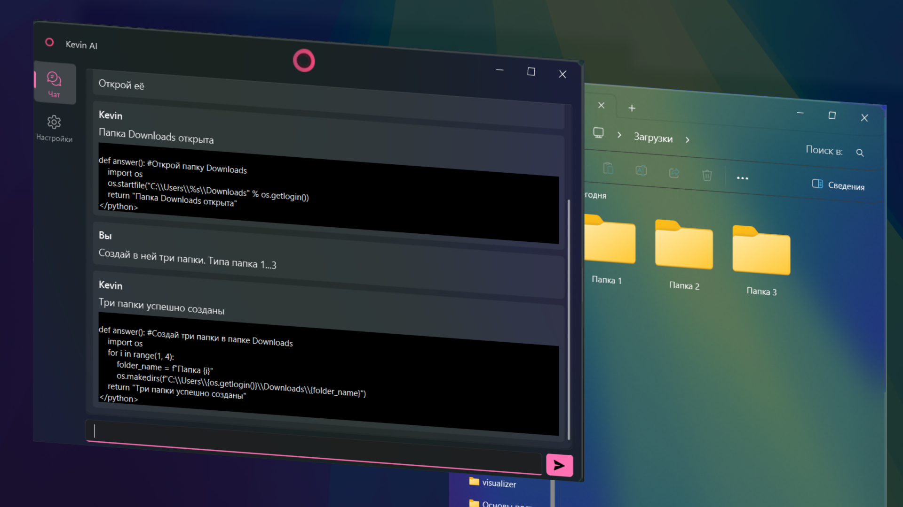
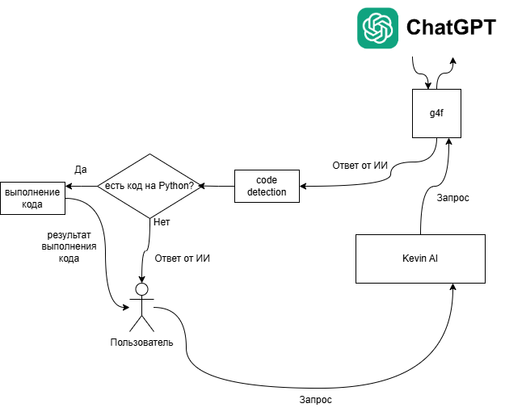

# Kevin AI
#### ИИ ассистент для Windows 10/11


> ### Важно
> Этот проект является экспериментом. 
> Всё, что вы делаете - вы делаете на свой страх и риск.
> Если вдруг действия программы приведут к потери данных и/или повреждению устройства - автор проекта не несёт никакой ответственности.
> (Я вас предупредил)

### Предисловие
Что произойдёт, если мы спросим у ChatGPT, например, текущее время?
На самом деле не произойдёт ничего интересного. 
##### А что будет, если мы попробуем дать нейросети доступ к своему компьютеру для решения этой задачи?



Мы заставим языковую модель по необходимости генерировать код. 
Затем если в ответе от нейросети программа распознает код - она его выполнит и выведет пользователю результат его выполнения.
##### В итоге мы получаем умного помощника на базе ChatGPT, который может не только генерировать текст, но и выполнять конкретные задачи на ПК пользователя!

### Примеры использования
Программа не содержит никаких готовых сценариев распознавания команд и их выполнения.
Всё, что делает программа генерируется нейросетью в реальном времени.

Из-за этого результат выполнения может быть неточным или даже небезопасным.

Однако если вы готовы к этому, можете попробовать спросить у ассистента что-то подобное:
- Что у меня на рабочем столе?
- Открой диспетчер задач / настройки / программу / файл / что-то ещё
- Курс рубля
- Какой заряд батареи
- ...

### Установка
```
git clone https://github.com/dertefter/Kevin.git
cd Kevin
```

```
python -m venv venv
venv\Scripts\activate
pip install -r requirements.txt
python main.py
```